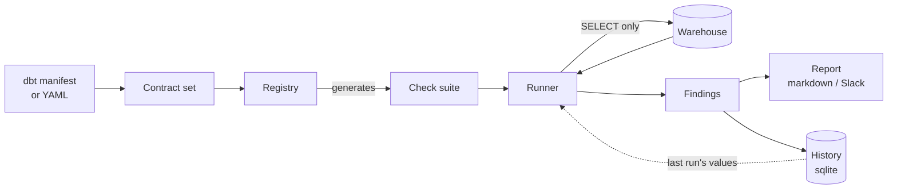

# 2 · How it works

No code in this document. If you want the modules, see the
[code walkthrough](06-code-walkthrough.md).

## In one sentence

Assay reads your metric definitions, works out what must be true if those
definitions are correct, asks the warehouse whether it is true, and tells you
where it is not.

## The four questions it asks

Every check belongs to one of four families. They are worth understanding as
questions rather than as check ids, because they catch genuinely different
classes of defect.

### Does the arithmetic close? — conservation

If `net_revenue` is £20,063,846 in total, then slicing it by region must
produce parts summing to £20,063,846. When it does not, something in the
traversal to `region` is losing or duplicating rows.

This is the highest-yield family. In the demo it catches a region lookup table
missing a newer region (10% of revenue silently vanishes when sliced), and an
`order_items` join at line-item grain rather than order grain (revenue inflated
by 150%).

### Do the metrics agree with each other? — identity

If `net_revenue = gross_revenue − discount_total` is asserted, it must hold.
When it does not, two definitions have drifted apart, or a source table is
double-counted.

The subtler member of this family compares a metric with *itself* at different
grains. A metric computed daily and rolled up to a month must equal the same
metric computed natively at month. Anything grain-dependent — a distinct count,
a deduplication that only works inside a day — fails here and nowhere else.

### Has the past changed? — temporal

A closed month's value should not move. When it does, a backfill or a
late-arriving source has rewritten history, and every report anyone ran against
that month is now wrong without anyone knowing.

Every warehouse does this constantly. Almost no tool reports it.

### Is the question even legal? — structural

Some queries are wrong by construction: slicing a metric by a dimension it
cannot reach, requesting a finer grain than the metric is defined at, summing
something that must not be summed. These are rejected before the warehouse is
touched. In P0 they are enforced implicitly by the check generator; they become
first-class when the planner arrives.

## The path of one run

1. **Load contracts.** Metric definitions come from a dbt semantic manifest or
   a YAML file. Nothing is authored by hand for Assay's benefit.
2. **Generate the suite.** Each metric implies its own checks. A metric with
   three dimensions and one optional join implies more checks than a bare
   count. Nobody writes them.
3. **Run.** Each check asks the warehouse a question. Queries repeated within a
   run are executed once.
4. **Compare against history.** Restatement detection needs to know what the
   past looked like last night, so per-period values are kept in a local
   SQLite file.
5. **Report.** Markdown to a terminal or CI log; Block Kit to Slack. Exit `0`
   clean, `1` warnings, `2` a blocking failure.

## Why the checks are generated, not written

The conventional approach is a golden-query suite: write down the questions
that matter and the answers you expect, then assert on them.

It rots at exactly the rate the definitions do. Every metric change invalidates
some unknown number of goldens, by hand, and the person who changed the metric
is not the person who wrote them. This is the same rock that hand-authored
semantic layers die on, and adding a test suite to it doubles the maintenance
rather than solving it.

A metric contract already contains everything needed to know what must be true
of it. `additivity: additive` is a *claim*, and IDN-03 is that claim tested. A
declared join is a claim that the traversal is many-to-one, and CON-04 is that
claim tested. Generation means a definition change regenerates its own checks,
and there is nothing to maintain separately.

The guards on generation matter as much as the generation. Assay will not emit
a decomposition check for a non-additive metric, because summing groups of a
distinct count would fail forever and mean nothing — and a check that cries
wolf trains people to ignore the report, which is worse than having no report.

## What it deliberately does not do

- **It does not fix anything.** Findings, not repairs.
- **It does not write.** The adapter refuses any statement that is not a query.
- **It does not judge prose.** Narrative checks need an answer to have prose,
  which needs a planner, which is P3.
- **It does not replace dbt tests.** Column-level assertions are dbt's job.
  None of the seven demo defects has a bad column.
