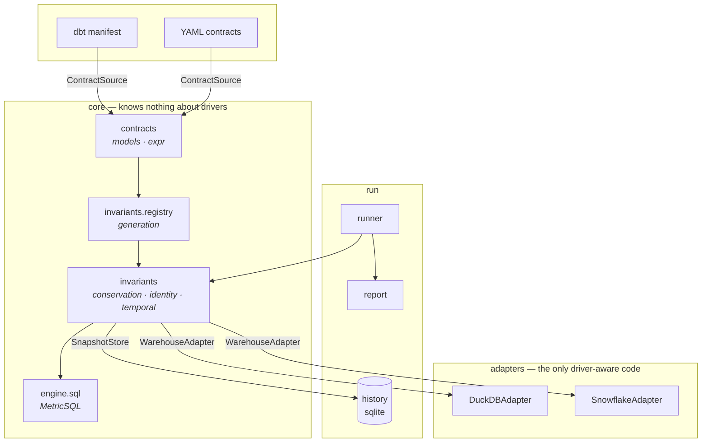
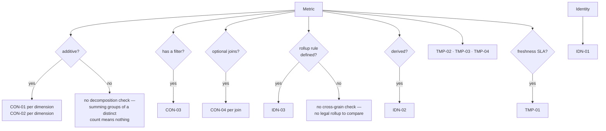
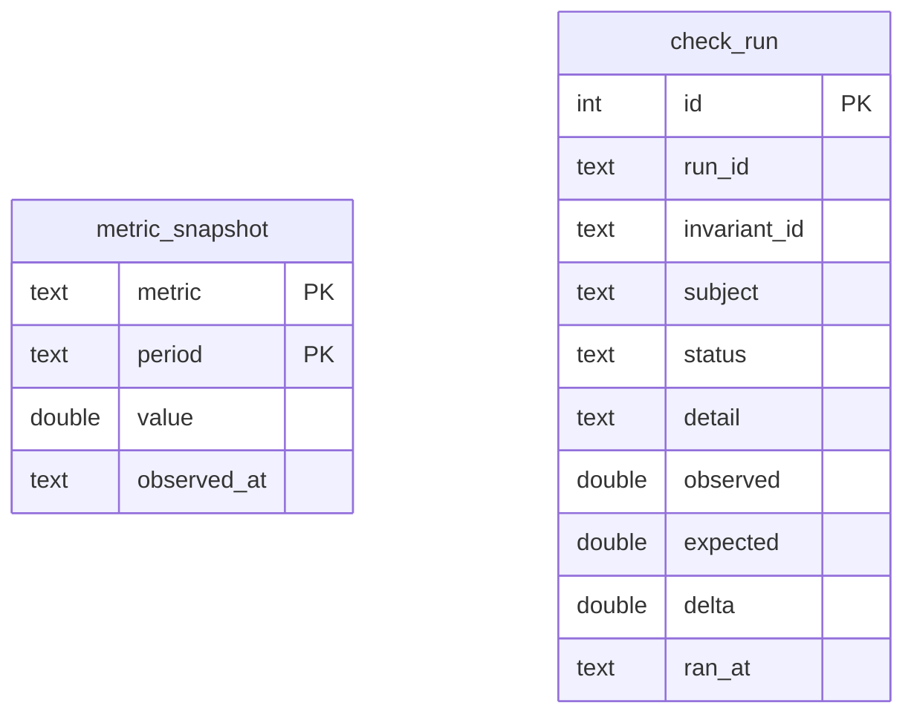
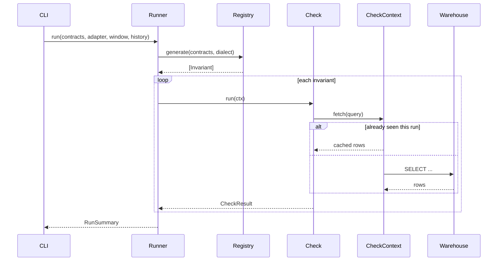

# 3 · Technical design

## Architecture

Ports and adapters. Three protocols form the boundary; everything inside is
independent of where definitions come from, which warehouse executes, and how
history is persisted.



### The three protocols

| Protocol | Defined in | Implementations | Why it exists |
|---|---|---|---|
| `ContractSource` | `contracts/sources.py` | `YamlSource`, `DbtManifestSource` | A new definition format is a new class, not an edit |
| `WarehouseAdapter` | `engine/adapter.py` | `DuckDBAdapter`, `SnowflakeAdapter` | The same suite runs in milliseconds against a test file and against production |
| `SnapshotStore` | `invariants/base.py` | `History` | Invariants stay independent of how history is persisted |

`SnapshotStore` is declared in the invariants package rather than imported from
`run`, so the dependency points inward. Nothing in `contracts`, `engine`, or
`invariants` imports from `run`.

## Contract model

The vocabulary every check is generated from. Immutable (`frozen=True`), and
validated at load: identifiers must be bare SQL identifiers, and SQL fragments
are rejected if they contain statement terminators, comment markers, or
`UNION`/`DROP`/`INSERT`.

```
Metric        name, table, measure, time_column, additivity, min_grain, unit,
              tolerance, freshness_sla_hours, derived, owner
              dimensions[]  -> Dimension(name, column, table?)
              joins[]       -> Join(table, left_key, right_key, kind, required)
              where?

Identity      name, lhs (metric), rhs (expression over metrics), tolerance

ContractSet   metrics[], identities[], version
```

### Additivity is the load-bearing field

Most wrong analytics answers are grain errors wearing a plausible number, so
how a metric may be rolled up is a contract term rather than a hint.

| Class | Rollup rule | Example | Prevents |
|---|---|---|---|
| `additive` | Sum across every dimension including time | `net_revenue` | — |
| `semi_additive` | Sum across non-time dimensions; `last` across time | `active_seats` | Summing daily snapshots into a 30× overstatement |
| `non_additive` | Never summed; recomputed at the target grain | `churn_rate`, `distinct_users` | Averaging rates across unequal segments |
| `derived` | Recomputed from constituents after they roll up | `arpu` | Rolling up a per-row ratio |

This field decides which checks are generated. Declaring a distinct count
`additive` is a lie the contract tells, and IDN-03 exists to catch it.

## Check generation

The registry turns a contract set into a suite. Guards are as important as
generators: emitting the wrong check manufactures a permanent false positive,
and a report that cries wolf is worse than no report.



Complexity is `O(metrics × dimensions)` in suite size.

## Query construction

`MetricSQL` is the single place identifiers are quoted and values are bound.
Nothing else in the codebase emits SQL.

The design constraint that produces the rest: **a check names metrics and
dimensions; it never names a table.** Join paths are resolved from the
contract. That is what makes a fan-out detectable rather than accidental.

| Builder | Used by | Shape |
|---|---|---|
| `total(window)` | CON-01, IDN-01/02 | Ungrouped value, only joins the measure needs |
| `grouped(dim, window)` | CON-01, CON-02 | Grouped by one dimension, NULL group preserved |
| `by_period(grain, window)` | IDN-03, TMP-02/03/04 | One row per period, ascending |
| `row_counts(join, window)` | CON-04 | Base count vs count after one traversal |
| `filter_mass(window)` | CON-03 | Rows kept by the metric's own filter, and rows before it |
| `max_time()` | TMP-01 | Latest timestamp present |

Two details carry weight:

- **`total()` includes only joins the measure itself depends on**, while
  `grouped()` adds the traversal needed to reach the dimension. If they used
  the same `FROM`, their sums would agree by construction and CON-01 would be
  tautological. The difference between them *is* the check.
- **Window bounds are bound parameters**, never interpolated. Identifiers are
  validated at load and quoted here.

## Dialect differences

| Concern | DuckDB | Snowflake |
|---|---|---|
| Identifier case | Preserved | Folded to upper unless quoted — so contracts are folded before quoting; `--case-policy exact` for projects that created quoted lower-case objects |
| Bind style | `?` | Connector defaults to `pyformat`; switched to `qmark` at connect |
| Read-only | Native connection flag | No such flag — enforced by a `SELECT`/`WITH` guard plus a `SELECT`-only role |
| Date truncation | `date_trunc('month', x)` | `DATE_TRUNC('MONTH', x)` |

Each of these produces a *wrong answer* rather than an error if handled
carelessly, which is why they are explicit rather than incidental.

## Data model

Two stores with different jobs.

**Contracts** — files in version control, immutable, reviewed like code.

**History** — local SQLite, written by the run.



`metric_snapshot` is the baseline TMP-03 compares against: the primary key is
`(metric, period)`, so a run upserts the current series and the next run sees
what changed. `check_run` is an append-only log, indexed on
`(invariant_id, subject, ran_at DESC)`.

SQLite rather than the warehouse — writing history to the warehouse would
require write grants, which destroys the read-only posture that makes Assay
safe to point at production. See [D-04](04-design-decisions.md#d-04--history-lives-in-sqlite-not-the-warehouse).

## Execution model



Three properties fall out:

- **A broken check is reported, never fatal.** One bad contract cannot stop the
  suite; the failure becomes a finding.
- **Queries are memoised per run.** CON-01 and CON-02 legitimately need the
  same grouped query. Against Snowflake a scan costs ~0.37s of round trip, so
  31 checks collapsing to 24 scans is a real saving, not a nicety.
- **The clock is injected.** `--as-of` makes temporal checks deterministic;
  tests assert exact lag hours rather than approximating.

## Severity and exit codes

| Severity | Meaning | Example |
|---|---|---|
| `block` | The number is wrong | CON-01, CON-04, IDN-01, IDN-03, TMP-03 |
| `warn` | The number may mislead | CON-02, CON-03, TMP-01, TMP-02 |
| `note` | Telemetry | TMP-04 |

`assay run` exits `0` clean, `1` warnings only, `2` on a blocking failure.
`assay doctor` uses the same convention.

## Test strategy

| Layer | Substrate | Speed |
|---|---|---|
| Unit | `FakeAdapter` returning canned rows keyed on a SQL fragment | milliseconds |
| Integration | Real DuckDB seeded with seven planted defects | ~14s |
| Live | A real Snowflake account, run by hand | ~9s |

159 tests. The integration suite asserts each planted defect is found *and
named*, then restates a closed month and asserts the second run notices —
including that metrics the backfill did not touch stay quiet.

The Snowflake adapter is tested against a fake connector, so identifier
folding, bind style, the read-only guard and credential handling are covered
offline. What that cannot cover is whether real Snowflake behaves as assumed,
which is why the demo dataset is loadable into a real account: the expected
findings are already known, so any divergence is the adapter's fault and
nowhere else. Run that way, the reports are byte-for-byte identical.
