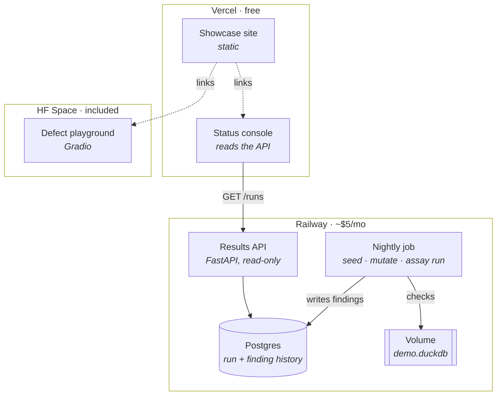

# 10 · Deployment and showcase plan

A plan, not an implementation. Nothing here is deployed.

## First, a distinction the rest depends on

[Doc 01](01-prd.md#non-goals) lists "no dashboard" as a non-goal, so this
document has to be careful not to quietly contradict it. Three different things
get called a dashboard:

| | What | Verdict |
|---|---|---|
| **An interface for executives asking questions** | Type a question, get a number | **Still a non-goal.** That is P3, and shipping it early is the mistake the whole thesis is about |
| **A status console for the data team** | Check results over time, per-metric trend | **Legitimate.** This is P1's trust console, and it is for the operator, not the consumer |
| **A public showcase** | A marketing page demonstrating what Assay finds | **Neither.** Not part of the product, and it should live in a separate deployment with no access to anything real |

Everything below concerns the second and third. The first stays deferred.

## Platform assessment

**RunPod — no use.** Assay has no model, no inference, no GPU workload. Forcing
it in would cost money and prove nothing. Leave it for the fine-tuning work.

**Vercel — the showcase, and later the console.** Static, free, no credentials,
nothing to keep alive. Most of the value is here.

**Railway — the live demo, and the P1 prototype.** Postgres, a scheduled job, a
small API. The moment history moves from SQLite to Postgres you have an answer
log more than one person can read, which is exactly what
[D-04](04-design-decisions.md#d-04--history-lives-in-sqlite-not-the-warehouse)
said would need revisiting at P1.

**Hugging Face Spaces — an optional playground.** A Gradio app that toggles
each planted defect on and off so a visitor watches findings appear and
disappear. Teaches the idea faster than prose; slightly off-brand on an
ML-first platform.

## Target architecture



**The demo warehouse is synthetic and self-contained.** Nothing in this diagram
touches a real Snowflake account, holds a real credential, or reads customer
data. That is deliberate: a public demo that can reach production is a breach
waiting for a misconfiguration.

## Tier 1 — Vercel showcase

The complete showcase on its own. Build this first; the rest is optional.

### What goes on the page

**Lead with the restatement, not a feature list.** It is the finding no other
tool reports and the one a visitor cannot get from dbt tests or an anomaly
detector:

> **Monday** — Q2 churn: 4.2%
> **Tuesday** — same query, same definition: 6.8%
> **Nobody was told.**

Then, in order:

1. The thesis in one line — a governed metric guarantees consistency, not
   correctness.
2. Real report output, verbatim. Five failures and two warnings, exactly as the
   terminal prints them.
3. The seven defects, each with why it is invisible in a dashboard. `IDN-03`
   carries the most weight: nothing is wrong with the data or the SQL, the
   metric is *labelled* wrong.
4. Why not dbt tests / anomaly detection / golden queries — the summary of
   [doc 04](04-design-decisions.md), which is the objection every informed
   visitor will raise.
5. The 60-second local quickstart. No credentials, no warehouse, verified on
   their own machine.

### Structure

```
site/
  index.html          one page; no framework needed
  assets/
    report.txt        real output, not a mockup
```

Static HTML is enough. A framework here is cost without benefit.

### Deploying

```bash
cd site && vercel --prod
```

### An honest technical note

DuckDB has a WASM build, so the demo *could* run in the visitor's browser.
Assay is Python, so that needs Pyodide — a heavy lift for a landing page. **A
precomputed report presented honestly beats a fake live one.** Label it as
recorded output; do not animate a terminal to imply it is running.

## Tier 2 — Railway live demo

Proves it runs continuously, which is a different and harder claim than
"it works once".

### Services

| Service | Role |
|---|---|
| Postgres | Run and finding history — the P1 answer log in miniature |
| Cron job | Nightly: seed, mutate one closed month, run Assay, write findings |
| API | FastAPI, read-only: `/runs`, `/runs/{id}`, `/metrics/{name}/history` |
| Volume | Holds `demo.duckdb` between runs |

### One decision to make first

Assay has adapters for DuckDB and Snowflake, **not Postgres**. So the demo
warehouse is either:

- **DuckDB on a Railway volume** — no new code, works today. Recommended for a
  demo.
- **A Postgres adapter** — roughly the size of the DuckDB one, and it would
  exercise the warehouse seam a third time. Genuinely useful beyond the demo,
  but it is product work, not showcase work.

Similarly, writing findings to Postgres needs a second `SnapshotStore`
implementation. Keeping SQLite on the volume avoids that for a demo; Postgres
is the right answer when more than one person reads the log.

### Why the nightly mutation matters

A static demo shows one report. A demo that **restates a closed month every
night** shows the thing that makes Assay different: yesterday's number moved,
and here is who would have been told. That single behaviour is worth more than
every other page on the site.

### Cost

Hobby tier, roughly $5/month. Assay's own workload is negligible — the job is
seconds of CPU. Postgres and the always-on API dominate.

## Tier 3 — Status console

A page on Vercel reading the Railway API. Not an executive dashboard; an
operator's view.

- Latest run: pass / warn / fail counts
- Per-metric check history — which checks fired, when
- The restatement timeline: every closed period that has moved, and when it
  moved

This is the first honest sketch of P1's trust console, and building it against
a synthetic demo is the cheapest way to find out what it should contain.

## Tier 4 — Hugging Face playground

A Gradio app with seven toggles, one per planted defect. Toggle one off, re-run,
watch the corresponding finding disappear. Toggle it back, watch it return.

It makes the causal link between a defect and a check visible in a way that
static output cannot, and it is the best format for explaining `IDN-03` — flip
`active_users` between `additive` and `non_additive` and watch a 1477%
discrepancy appear from a change to a single label.

Space runs on the free CPU tier; DuckDB in-process, no warehouse.

## Cost summary

| Platform | Role | Cost |
|---|---|---|
| Vercel | Showcase + console | $0 (hobby) |
| Railway | Postgres, cron, API | ~$5/month |
| Hugging Face | Playground Space | Included in Pro |
| RunPod | — | $0, unused |

## Security rules for anything public

1. **The public demo never touches a real warehouse.** Synthetic data only, in
   its own project, with no credential that reaches production.
2. **No Snowflake credential leaves the operator's machine.** The Snowflake
   result is a documented claim in the README, not something strangers
   reproduce on your account.
3. **The results API is read-only and serves no credentials** — findings and
   figures from synthetic data, nothing else.
4. **No run trigger exposed publicly.** A "run it now" button is a free
   denial-of-wallet primitive.
5. **Redeploy from a clean checkout.** `.env` is gitignored; keep it that way,
   and never bake one into an image.

## Recommended order

1. **Tier 1 alone.** A complete showcase, zero infrastructure, nothing to keep
   alive. If it does not persuade anyone, tiers 2–4 will not either.
2. **Tier 2 + 3** if continuous operation is the claim worth making — and take
   the Postgres history seriously, because that is P1 work wearing a demo hat.
3. **Tier 4** when explaining the concept repeatedly becomes the bottleneck.

Do not build all four at once. Each is separately abandonable, and a showcase
nobody visits is worse than no showcase, because it has to be maintained.
