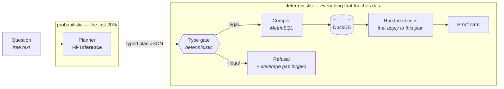
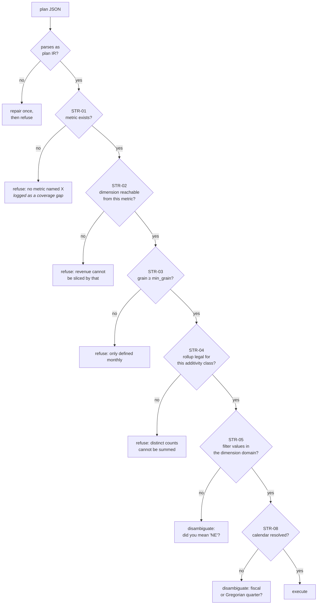
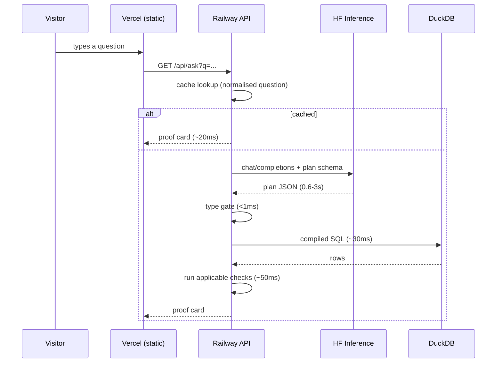
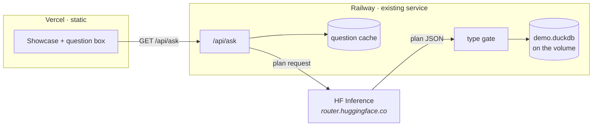

# 11 · NLQ planner — build plan

**Status: steps 0 and 1 complete. Steps 2-4 not built.** The model is chosen
on evidence, and the plan IR and type gate exist with 37 tests. No model is
wired in yet.

## What is being built

A question box on the showcase that answers in natural language — with the
model doing intent resolution only, and everything after it deterministic.

> "net revenue by region last quarter"

```
net_revenue · by region · 2026-Q2                 12,048,298.74

  ✓ CON-01  parts sum to the whole            within 0.1%
  ✖ CON-01  2,097,007.23 (10.45%) lost in the traversal to regions
  ⚠ CON-02  5.31% of this metric has no region
  ✓ TMP-01  latest row 9h old, inside a 48h SLA
  ⚠ answered from 1 provisional definition

  plan:  {"select":["net_revenue"],"by":["region"],"time":{...}}
```

The proof card is the point. A number alone from an LLM is the thing this
project argues against; a number with the checks that ran against it is the
thing it argues *for*.

## The one design decision everything follows from

**The model emits a plan, never SQL.**

If it wrote SQL, we would be back to unverifiable output and the demo would
contradict the page it sits on. A plan is a closed grammar over metrics and
dimensions the contract already defines, so a deterministic gate can *prove*
it legal before the warehouse is touched.



Note where the boundary sits. **No model output reaches the warehouse
unvalidated**, and no model judgment decides whether an answer is correct.

## The type gate

This is the component that makes the demo honest. It is pure functions over
the plan and the contract set — no warehouse access, sub-millisecond.



**Refusals are the best part of the demo, not a failure mode.** Ask for
something that does not exist and the system declines with a reason instead of
inventing a number. Every refusal is logged as a coverage gap — the roadmap
written by users, in their own words.

## Where the model sits, and what constrains it

Two constraints, applied together:

1. **The JSON schema is generated from the contract set.** Legal metric names
   and dimension names are enum values in the schema, so a compliant response
   cannot name something that does not exist.
2. **The gate assumes the model lied anyway.** Schema compliance varies by
   provider and model; validation is not optional because the schema was sent.

```
system prompt  ← metric catalogue rendered from ContractSet
                 (names, dimensions, grains, additivity, synonyms)
response_format ← JSON schema with metric/dimension enums
   ↓
{"kind":"query",
 "select":["net_revenue"],
 "by":["region"],
 "where":[],
 "time":{"kind":"relative","anchor":"quarter","offset":-1,
         "calendar":"cal:finance_fy"}}
```

On invalid JSON or a schema violation: **one** repair attempt with the error
fed back, then refuse. No unbounded retry loop — that is a cost leak.

## Model choice on HF Inference

Serverless via the OpenAI-compatible router, authenticated with the Pro token:

```
POST https://router.huggingface.co/v1/chat/completions
Authorization: Bearer $HF_TOKEN
```

| Candidate | valid | answers | refusals | p50 | p95 |
|---|---|---|---|---|---|
| **`Qwen/Qwen2.5-72B-Instruct`** | **100%** | **95%** | **100%** | **1.69s** | **2.60s** |
| `Qwen/Qwen3-30B-A3B` | 93% | 86% | 75% | 0.69s | 1.93s |
| `Qwen/Qwen3-8B` | 67% | 41% | 88% | 2.20s | 2.55s |
| `meta-llama/Llama-3.3-70B-Instruct` | 87% | 68% | 100% | 1.04s | 3.69s |
| `mistralai/Mistral-Small-24B` | — | — | — | — | not served by the router |

32 questions: 22 answerable, 2 ambiguous, 8 that must be declined. Run against
the demo contract set, which is deliberately lopsided — only `net_revenue`
declares dimensions — so a model that pattern-matches "X by Y" without reading
the catalogue gets caught.

**Chosen: `Qwen/Qwen2.5-72B-Instruct`.** Every plan legal, every refusal
correct, and one miss in 32 (it declined "monthly active users", which is
cautious rather than wrong). p50 1.69s sits inside the latency budget.

### The finding that matters more than the model

`Qwen3-30B-A3B` is **2.4× faster** and refuses only 75% of what it must. Its
two dangerous errors were exactly the failure the question set was built to
provoke:

```
should have refused   active users by region    → picked active_users by [region]
should have refused   gross revenue by segment  → picked gross_revenue by [segment]
```

Both metrics declare no dimensions. **The type gate rejected both.** That is
why its validity is 93% rather than 100%: the two invalid plans are precisely
the two dangerous ones.

So with the *weaker, faster* model the system would still never have produced
a wrong number — it would have produced a refusal. The model choice buys
answer quality; the gate buys correctness, and the gate is deterministic.

That is the "model is the last 20%" claim as a measurement rather than a
slogan, and it is worth putting on the page.

**Latency loses to refusal accuracy.** 0.69s against 1.69s is a real
difference, and it is not worth a model that invents a slice for one question
in four that should have been declined. A public demo of a correctness tool
cannot ship the fast-and-loose option.

### Harness corrections found by running it

Two of the leader's original three "misses" were the harness's fault, not the
model's, which is the ordinary result of measuring something for the first
time:

- The plan schema had **no `where` field**, so "net revenue for the enterprise
  segment" was inexpressible. The model did the best legal thing — grouped by
  segment — and was scored wrong for it. Filters added.
- Bare nouns (`"tickets"`, `"discounts"`) name no measure, slice or period.
  Declining and asking is as defensible as guessing, so they are now scored as
  ambiguous and accept either. Counting a refusal there as a miss punishes the
  exact caution the rest of the system is built around.

## Latency



The model dominates: **~1–3s cold, ~20ms cached.** Everything Assay itself
does is under 100ms. Worth showing that split on the page — it is the "last
20%" claim as a measurement rather than a slogan.

## Deployment



Nothing new to stand up. The Railway service already holds the warehouse, the
contracts and the check engine; this adds an endpoint. `HF_TOKEN` becomes a
Railway variable and never reaches the browser.

## Cost and abuse control

A public endpoint that calls a paid model is a denial-of-wallet primitive, so
the controls are part of v1, not a follow-up:

| Control | Value | Why |
|---|---|---|
| Question length cap | 240 chars | Bounds input tokens |
| `max_tokens` | 300 | A plan is small; nothing legitimate needs more |
| Per-IP rate limit | 20/hour | Ordinary abuse |
| Global daily budget | 500 calls, then cached-only | Hard ceiling; the page degrades to the canned examples |
| Question cache | normalised text → plan | Demo traffic repeats heavily |
| Suggested questions | 6 prefilled | Most visitors click rather than type, and those are all cache hits |

Expected real cost: a few hundred calls a day at ~500 input / 150 output
tokens. Comfortably inside Pro credits.

## Failure modes

| Failure | Behaviour |
|---|---|
| Model returns invalid JSON | One repair attempt, then refuse with "could not interpret that" |
| Model names a metric that does not exist | STR-01 refuses; logged as a coverage gap |
| Model picks an illegal slice | STR-02/03/04 refuses with the specific reason |
| HF Inference down or rate-limited | Page falls back to the six canned examples; the box says why |
| Ambiguous period | STR-08 asks fiscal or Gregorian rather than guessing |
| Budget exhausted | Cached questions still answer; new ones say the demo is rate-limited |

## What changes on the existing site

The page currently closes with *"No language model, no query interface"* —
which becomes false. It needs rewording to the accurate claim, which is
stronger anyway:

> The model resolves intent into a typed plan. It never writes SQL, never
> reaches the warehouse, and never decides whether an answer is correct.

## Scope

**In v1**

- `Query` plans only — metric, dimensions, filters, time. No `Compare`,
  `Trend`, `Rank`, `Decompose`.
- Type gate rules STR-01, 02, 03, 04, 05, 08.
- Proof card with the checks that apply to the plan, plus provisional flags.
- Refusal and disambiguation paths.
- Cache, rate limit, budget cap.

**Not in v1**

- Follow-up questions with conversational context. Real, and doubles the
  scope; the plan cache makes single questions fast enough to feel
  conversational first.
- Writing the answer as prose, which needs the narrative checks (`NAR-01..04`)
  to be safe. A number with checks is honest; a paragraph without them is not.
- Anything touching a real warehouse. Synthetic demo data only.

## Build order

| | Step | Verifies |
|---|---|---|
| 0 | ~~Spike: questions × candidate models~~ **done** | Qwen2.5-72B, and that the gate catches model errors |
| 1 | ~~Plan IR + type gate + unit tests~~ **done** | STR-01/02/03/05/08, 37 tests, no warehouse and no model |
| 2 | ~~HF planner behind the gate~~ **done** | End-to-end on Railway; guards pulled forward from step 4 |
| 3 | Proof card rendering + question box on Vercel | The visible product |
| 4 | ~~Cache, rate limit, budget cap~~ **done in step 2** | A public endpoint calling a paid model cannot ship without them |

Step 1 is the substantial one and it is fully testable without an LLM, which
is the right shape: the deterministic half is provable, the probabilistic half
is measured.
